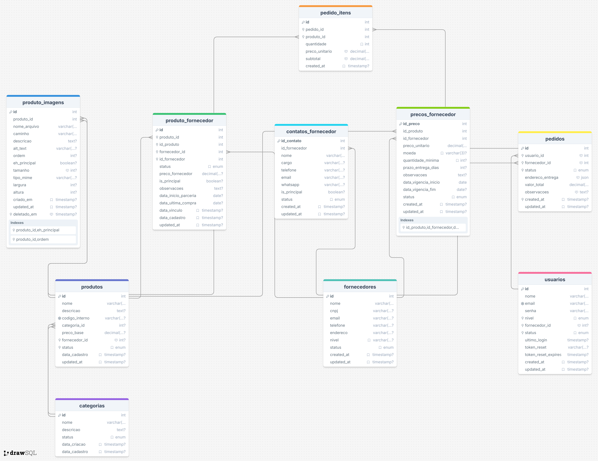

## Decisão de Modelagem do Banco de Dados

O banco de dados foi modelado visando flexibilidade, escalabilidade e clareza nas relações entre os principais elementos do sistema de um marketplace virtual. As principais decisões foram:

- **Separação de entidades principais**: Produtos, fornecedores, usuários, pedidos e categorias foram separados em tabelas distintas para garantir organização e facilitar manutenções futuras.
- **Relacionamentos claros**: Tabelas intermediárias como `produto_fornecedor` e `pedido_itens` permitem relacionamentos muitos-para-muitos, possibilitando que um produto tenha múltiplos fornecedores e um pedido contenha vários itens.
- **Histórico e controle de preços**: A tabela `precos_fornecedor` permite registrar variações de preço ao longo do tempo, facilitando auditorias e negociações.
- **Imagens e detalhes**: A tabela `produto_imagens` permite múltimas imagens por produto, com indicação de imagem principal, melhorando a experiência do usuário.
- **Controle de status e datas**: Diversas tabelas possuem campos de status e timestamps para rastrear alterações, ativações e desativações, garantindo integridade e histórico das operações.
- **Contato e informações detalhadas**: Tabelas como `contatos_fornecedor` e campos de endereço detalhado nos pedidos aumentam a robustez do sistema para operações reais.

Essas decisões visam garantir um banco de dados normalizado, de fácil manutenção, preparado para crescimento e mudanças de requisitos, além de facilitar integrações futuras e análises de dados.
 
---

### 1. Modelagem do Banco de Dados

A modelagem foi feita utilizando o conceito de normalização, separando as entidades principais e intermediárias para garantir integridade e flexibilidade. O diagrama abaixo ilustra as tabelas e seus relacionamentos:

Principais tabelas:
- **produtos**: armazena informações dos produtos.
- **fornecedores**: dados dos fornecedores.
- **usuarios**: usuários do sistema.
- **pedidos**: pedidos realizados.
- **categorias**: classificação dos produtos.
- **produto_fornecedor**: relação entre produtos e fornecedores, incluindo preço e status.
- **pedido_itens**: itens de cada pedido.
- **precos_fornecedor**: histórico de preços dos fornecedores.
- **produto_imagens**: imagens dos produtos.
- **contatos_fornecedor**: contatos adicionais dos fornecedores.

### 2. Por que escolhi essa estrutura

Optei por essa estrutura para garantir:
- **Escalabilidade**: fácil adicionar novas funcionalidades sem grandes mudanças na estrutura.
- **Flexibilidade**: permite múltiplos fornecedores por produto, múltiplas imagens, histórico de preços e controle detalhado de status.
- **Manutenção**: tabelas normalizadas facilitam manutenção, auditoria e integridade dos dados.
- **Performance**: consultas otimizadas por meio de relacionamentos bem definidos.

### 3. O que melhoraria se tivesse mais tempo

Se tivesse mais tempo, eu implementaria:
- **Procedures e triggers** para automatizar regras de negócio e garantir integridade adicional.
- **Índices avançados** para melhorar ainda mais a performance em consultas complexas.
- **Auditoria detalhada** de alterações em todas as tabelas sensíveis.
- **Documentação técnica** detalhada de cada tabela e relacionamento.
- **Testes de carga** para validar a performance em cenários reais de uso.
- **Implementação de views** para facilitar relatórios e integrações.

Essas melhorias trariam ainda mais robustez, segurança e facilidade de uso ao banco de dados.

